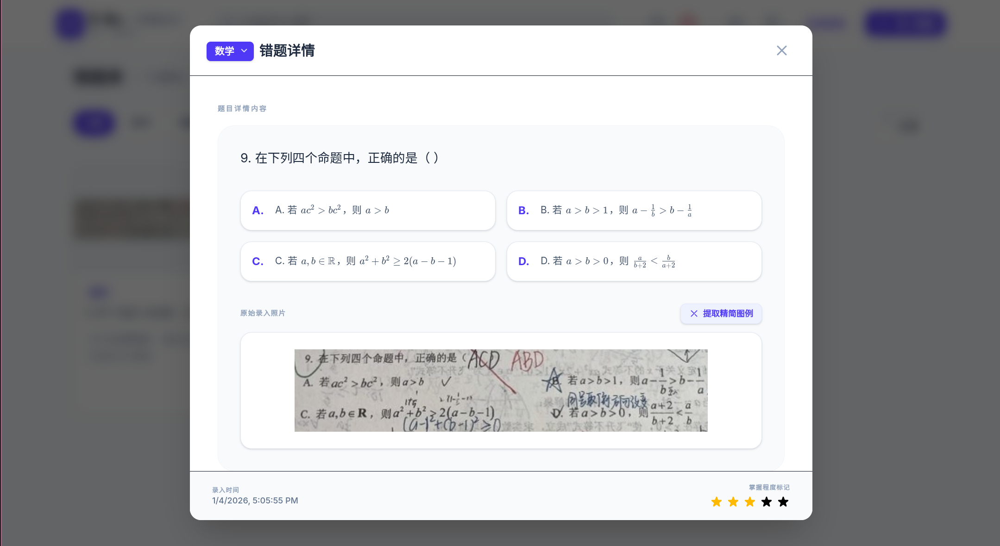

# E-Bu (易补) - AI 智能错题本

> **易补，知错能补。**

**E-Bu** (Easy Step / E-Book) 是一个现代化的、AI 驱动的错题管理与学习辅助系统。它利用先进的多模态大模型（Gemini, 通义千问, 豆包等）自动识别错题图片，提取题干、选项和解析，并生成针对性的学习建议，帮助学生高效整理错题，告别手抄。

## 🖥️ 界面



## ✨ 核心特性

- **📸 智能录入(Mobile & PC)**: 
  - 支持**手机拍照**（调用后置摄像头）和图库批量上传。
  - 内置**图像处理工具**：支持图片旋转、自由裁剪、自动压缩。
  - **批量静默处理**：一次性拍摄多张，后台队列处理，不阻塞当前操作。

- **🧠 多模态 AI 解析**: 
  - 自动识别复杂的数学公式 (LaTeX)、化学方程式和几何图形。
  - 结构化提取题干、选项、正确答案、详细解析和知识点标签。
  - 支持 **图例提取**：自动从题目中裁剪出纯净的几何图形或图表。

- **📖 练习册生成 (Workbook Generator)**:
  - 一键将选中的错题生成 A4 打印格式的练习册。
  - 支持**自定义标题**，去除答案和解析，生成“盲测”考卷。
  - 自动排版，支持双栏布局和原图对照模式。

- **📱 移动端优先设计**:
  - 全新的响应式 UI，完美适配手机、平板和桌面端。
  - 像原生 App 一样的全屏体验，操作流畅。

- **⚡ 多模型支持**: 
  - **Google Gemini**: 原生支持 Gemini。
  - **通义千问 (Qwen)**: 支持 Qwen-VL 系列模型。
  - **字节豆包 (Doubao)**: 通过 OpenAI 兼容模式支持豆包视觉模型。
  - **OpenAI Compatible**: 支持 DeepSeek, Claude 等任何兼容 OpenAI Vision API 的服务。

- **☁️ 全局数据数据**: 
  - 采用**后端数据库** (SQLite/Go) 存储所有数据。
  - **数据编辑**：支持修改题目科目、难易度星级、增删知识点标签。
  - **回收站机制**：防止误删，支持一键恢复或彻底删除。

## � 部署指南

### 方式一：Docker Compose 一键部署 (推荐)

适合个人服务器、NAS (群晖/威联通) 或安装了 Docker 的电脑。

```bash
# 1. 获取代码
git clone https://github.com/aymwoo/E-Bu.git
cd E-Bu

# 2. 启动服务
docker-compose up -d --build
```
- **访问地址**: `http://localhost` (端口 80)
- **数据存储**: 所有数据挂载在当前目录的 `./data/ebu.db`。

### 方式二：本地脚本一键运行 (Local Script)

适合 Windows/Linux/macOS 本地快速体验，无需 Docker (需安装 Go 和 Node.js)。

**Windows**:
双击运行根目录下的 `runserver.bat`。

**Linux / macOS**:
```bash
chmod +x runserver.sh
./runserver.sh
```

- 脚本会自动检查依赖、构建前端页面、并启动后端服务。
- **访问地址**: `http://localhost:8080` (端口 8080)
- **注意**: 本地运行模式下，如果使用局域网手机访问，请确保防火墙允许端口通过。

## 🛠️ 技术栈

### Frontend
- **Framework**: React 18 + Vite
- **Styling**: TailwindCSS
- **Math Rendering**: KaTeX (高性能 LaTeX 渲染)
- **Print Engine**: CSS Print Media Queries

### Backend
- **Language**: Go (Golang)
- **Web Framework**: Gin
- **Database**: SQLite (GORM, 单文件存储)

## ⚙️ 模型配置指南

系统启动后，点击右上角的 **设置 (Settings)** 图标配置 AI 服务商。

1. **Google Gemini (推荐)**: 申请 [Google AI Studio](https://aistudio.google.com/) Key。模型推荐 `gemini-2.0-flash-exp`。
2. **通义千问 (Qwen)**: 申请 [阿里云百炼](https://bailian.console.aliyun.com/) Key。模型推荐 `qwen-vl-max`。
3. **豆包 (Doubao)**: 申请 [火山引擎](https://console.volcengine.com/) Key。在此处填写 Endpoint ID 而非模型名。

## 📁 目录结构

```
.
├── backend/                # Go 后端工程 (API & Database)
├── components/             # React 组件 (UI Logic)
│   ├── CaptureQuestion.tsx # 拍照、剪裁与批量上传
│   ├── WorkbookGenerator.tsx # 练习册生成器
│   └── ...
├── services/               # 前端服务层
├── runserver.sh            # Linux/Mac 启动脚本
├── runserver.bat           # Windows 启动脚本
├── docker-compose.yml      # Docker 编排配置
└── README.md
```

## License
[MIT](LICENSE)
